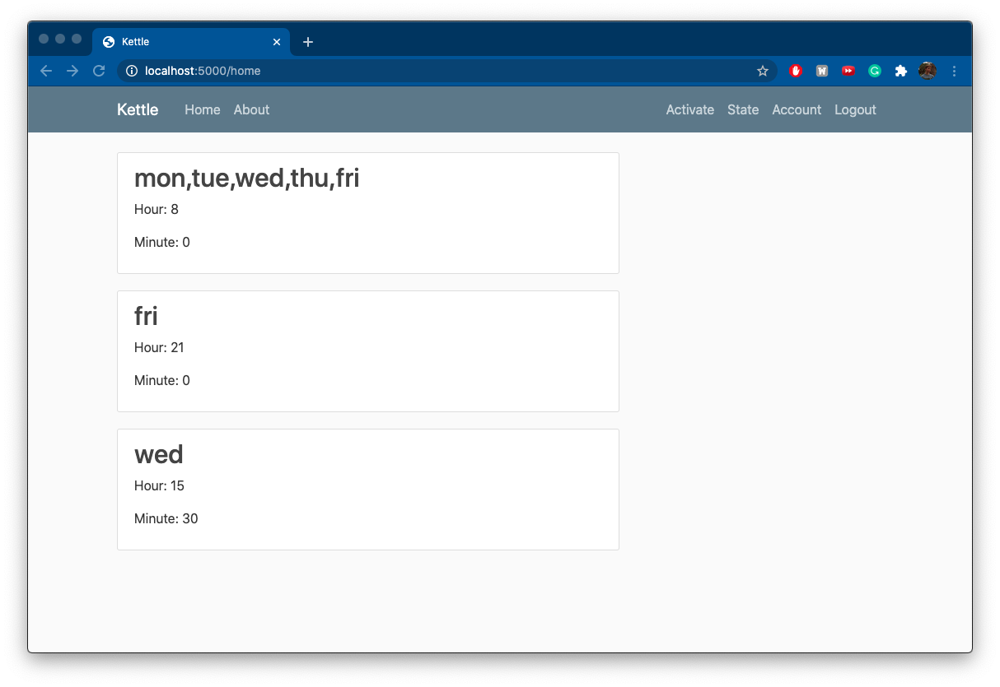
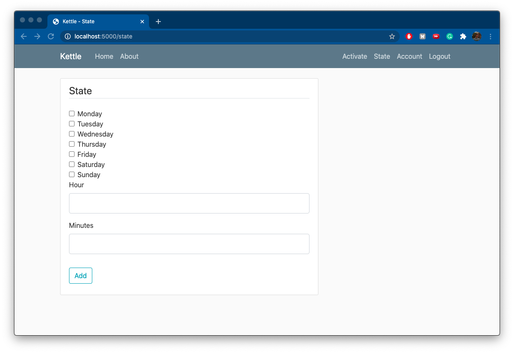
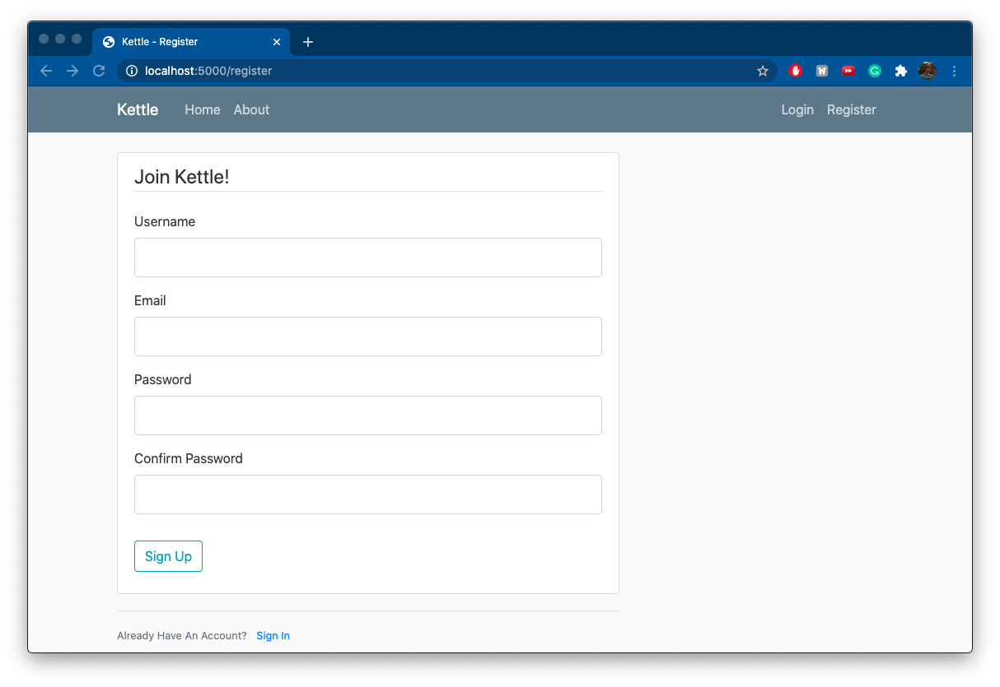
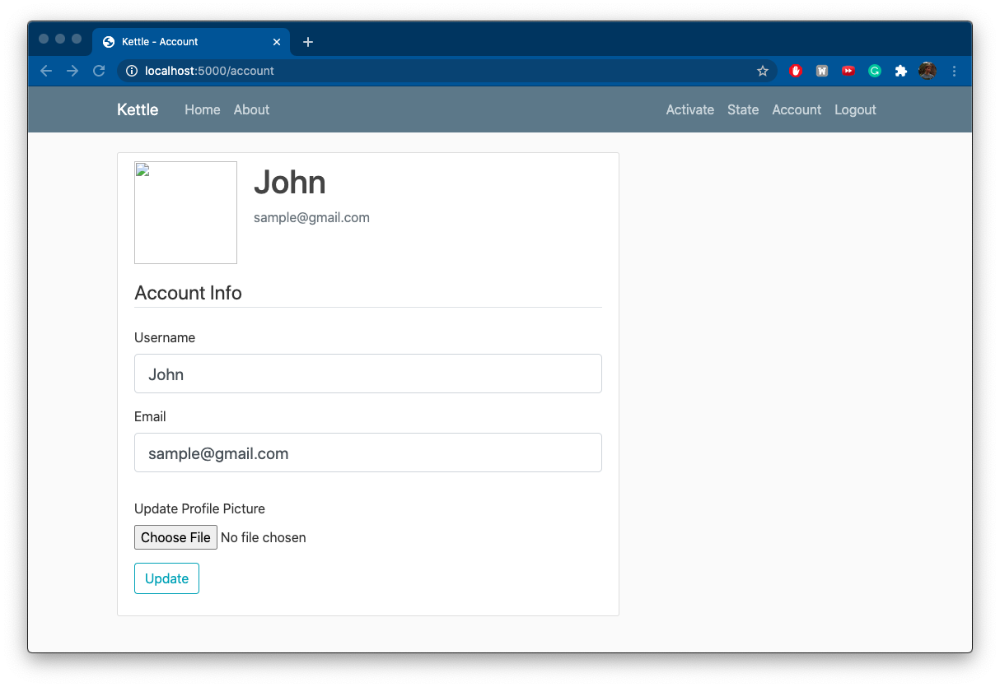

# Kettle
Kettle is a web app created using flask (and many other related modules), SQLAlchemy, bootstrap, and apscheduler. The applications purpose is to schedule weekly-repeating events that activate a servo that turns on a tea kettle. While the current use of the web app is quite specific, it could be used in many other ways where a user database and an event scheduler are needed.

## Functionality

The web app uses sqlite Data Base with SQLAlchemy handling it (The db could be switched to PostgreSQL for production). The db holds the apscheduler events, the events but in a different location for displaying them, and the Users. The apscheduler event currently uses a Cron like style for their scheduling. When the event hits its activation date-time it calls a function, and in my case it is the <code>runKettle()</code> method which turns on the servo that flips the kettle switch. This method could be replaced with whatever you have in mind that you would like to run. More info about [APscheduler](https://apscheduler.readthedocs.io/en/stable/)

The main functions the webapp features in the most recent version:
- scheduling weekly-repeating events
- deleting events
- turning the Kettle on at the press of a button
- updating your user profile (picture, email, username)

## Demo
Home Page When Logged in, with events scheduled

The State page where you create events

Register Page

Login Page

Account Page

## Future Features
- single day/date-time scheduling
- ability to update an event
- reset password via email link

## Setup
1. To setup first start by making sure you have [python 3 installed](www.python.org)
2. Download and install the required modules used. This can be done by using pip/pip3 on the requirements.txt file. While in the Kettle directory on linux/mac you can use  <code> pip3 install -r requirements.txt</code>  to install the modules.
3. You need to edit the path to the site.db in the code. In routes.py on line 14 you will find <code>sched.add_jobstore('sqlalchemy', url='sqlite://///Users/user/Programs/site.db')
</code>  You must change the <code>/Users/user/Programs/site.db</code> to your path to the site.db file.
4. That is all the setup! Now just run <code>python3 run.py</code> and enjoy!

## Resetting DB
To reset the db go to the directory the app folder is in. Next open python3 and import the db from the app:
 <code>from app import db</code>
 Then delete all the tables by 
<code> db.drop_all()</code>
 Next add all the tables back and you're all set! 
<code> db.create_all()</code>

## Acknowledgements
- BootStrap code snippets where used in the making of this project
- To find the python modules I used in this project see the requirements.txt file
- This project was inspired by Corey Schafer's [Flask Series](https://www.youtube.com/playlist?list=PL-osiE80TeTs4UjLw5MM6OjgkjFeUxCYH)

